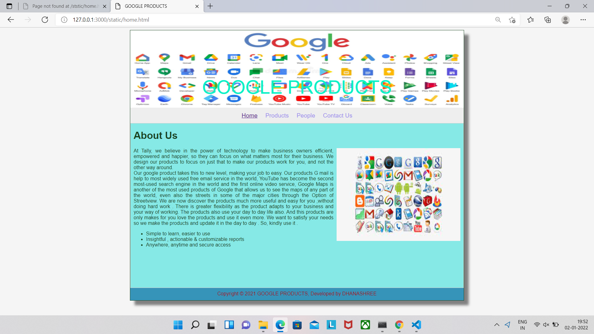
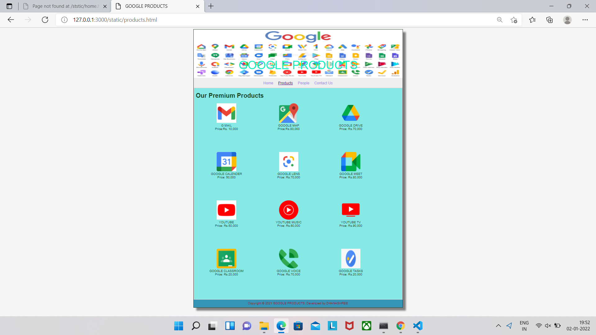
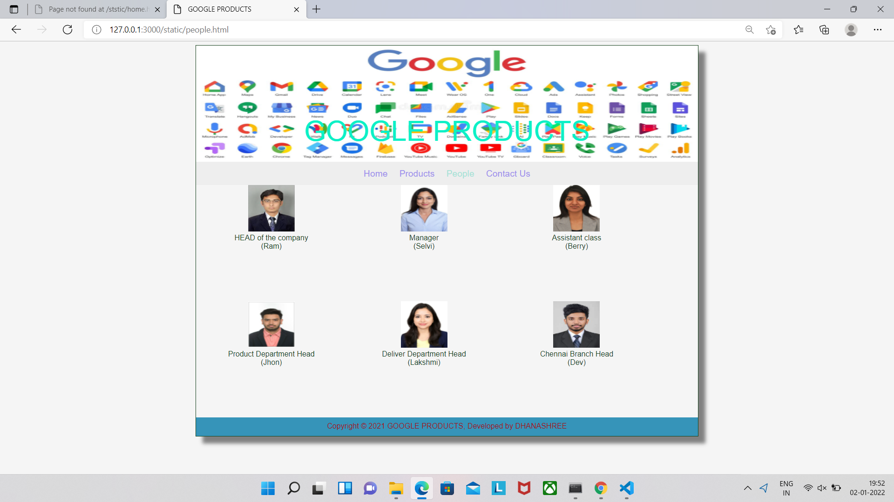
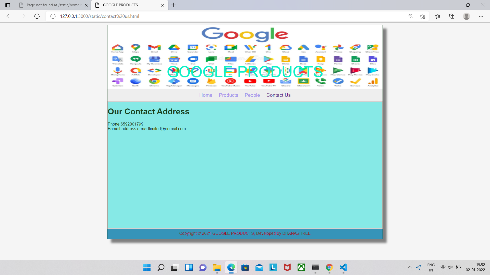

# Web Design for a Software Product Company

## AIM:

To design a static website for a software product company company.

## DESIGN STEPS:

### Step 1:

Requirement collection.

### Step 2:

Creating the layout using HTML and CSS.

### Step 3:

Updating the sample content.

### Step 4:

Choose the appropriate style and color scheme.

### Step 5:

Validate the layout in various browsers.

### Step 6:

Validate the HTML code.

### Step 6:

Publish the website in the given URL.

## PROGRAM :
HOME PAGE:
<!DOCTYPE html>
<html lang="en">
  <head>
    <title>GOOGLE PRODUCTS</title>
    <link rel="stylesheet" href="./css/layout.css" />
    <link rel="icon" href="./img/icon.png" type="image/x-icon" />
  </head>

  <body>
    

      
GOOGLE PRODUCTS

      

        
<a href="/static/home.html">Home</a>

        
<a href="/static/products.html">Products</a>

        
<a>People</a>

        
<a>Contact Us</a>

      

      

        

          <h1>About Us</h1>
          
          

            At Tally, we believe in the power of technology to make business
            owners efficient, empowered and happier, so they can focus on what
            matters most for their business. We design our products to focus on
            just that to make our products work for you, and not the other way
            around.
             
            Our google product takes this to new level, making your job to easy.
             Our products  G mail is help to most widely used free email service 
             in the world, YouTube has become the second most-used search engine
             in the world and the first online video service, Google Maps is another
             of the most used products of Google that allows us to see the maps
             of any part of the world, even also the streets in some of the major
             cities through the Option of  Streetview. We are now  discover  the
             products much more useful and easy for you ,without doing hard work .
             There is greater flexibility as the product adapts to your business
             and your way  of working. The products also use your day to day life also.
             And this  products are only makes for you love the products and use it even more. 
             We want to satisfy your needs so we make the products and update it in the day to day . 
             So, kindly use it .
            <ul>
              <li>Simple to learn, easier to use</li>
              <li>Insightful , actionable & customizable reports</li>
              <li>Anywhere, anytime and secure access</li>
            </ul>
          

        

      

      

        Copyright &#169; 2021 GOOGLE PRODUCTS, Developed by DHANASHREE
      

    

  </body>
</html>
PRODUCT PAGE:
<!DOCTYPE html>
<html lang="en">
  <head>
    <title>GOOGLE PRODUCTS</title>
    <link rel="stylesheet" href="./css/layout.css" />
    <link rel="icon" href="./img/icon2.png" type="image/x-icon" />
  </head>

  <body>
    

      
GOOGLE PRODUCTS

      

        
<a href="/static/home.html">Home</a>

        
<a href="/static/products.html">Products</a>
  
        
<a href="/static/people.html">People</a>

        
<a href="/static/contact us.html">Contact Us</a>

      

      

        
    
          <h1>Our Premium Products</h1>
          

              
 
                  

                  
                  

                  
G MAIL

                  
Price:Rs. 10,000

              

              
 
                  

                  
                  

                  
GOOGLE MAP

                  
Price:Rs.80,000

              

              
 
                  

                  
                  

                  
GOOGLE DRIVE

                  
Price: Rs.70,000 

              

              
 
                

                
                

                
GOOGLE CALENDER

                
Price: 50,000 

            

            
 
              

              
              

              
GOOGLE LENS

              
Price: Rs.70,000 

          

          
 
            

            
            

            
GOOGLE MEET

            
Price: Rs.80,000

        

        
 
          

          
          

          
YOUTUBE

          
Price: Rs.50,000 

      

      
 
        

        
        

        
YOUTUBE MUSIC

        
Price: Rs.60,000 

    

    
 
      

      
      

      
YOUTUBE TV

      
Price: Rs.90,000 

    

    
 
       

       
       

       
GOOGLE CLASSROOM

       
Price: Rs.20,000 

    

    
 
      

      
    

       
GOOGLE VOICE 

       
Price: Rs.70,000 

    

    
 
      

      
     

        
GOOGLE TASKS

        
Price: Rs.20,000 

      

    

  
        
  

    

      Copyright &#169; 2021 GOOGLE PRODUCTS, Developed by DHANASHREE
    

  

 </body>
</html>
CONTACT PAGE:
<!DOCTYPE html>
<html lang="en">
  <head>
    <title>GOOGLE PRODUCTS</title>
    <link rel="stylesheet" href="./css/layout.css" />
    <link rel="icon" href="./img/icon2.png" type="image/x-icon" />
  </head>

  <body>
    

      
GOOGLE PRODUCTS

      

        
<a href="/static/home.html">Home</a>

        
<a href="/static/products.html">Products</a>
  
        
<a href="/static/people.html">People</a>

        
<a href="/static/contact us.html">Contact Us</a>

      

      
        

           <h1>Our Contact Address</h1>  
        
          

           Phone:6592001799
            Eamail-address:e-martlimited@eemail.com
          

        

     

  Copyright &#169; 2021 GOOGLE PRODUCTS, Developed by DHANASHREE

</body>
</html>
PEOPLE PAGE:
<!DOCTYPE html>
<html lang="en">
  <head>
    <title>GOOGLE PRODUCTS</title>
    <link rel="stylesheet" href="./css/layout.css" />
    <link rel="icon" href="./img/icon2.png" type="image/x-icon" />
  </head>

  <body>
    

      
GOOGLE PRODUCTS

      

        
<a href="/static/home.html">Home</a>

        
<a href="/static/products.html">Products</a>
  
        
People</a>

        
<a href="/static/contact us.html">Contact Us</a>

      

      
 
        

        
      

         
HEAD of the company
            
           (Ram)
         

      

      
 
        

        
      

         
Manager
            
           (Selvi)
         

      

      
 
        

        
      

         
Assistant class  (Berry)

      

      
 
        

        
      

         
Product Department Head   (Jhon)

      

      
 
        

        
      

         
Deliver Department Head   (Lakshmi)

      

      
 
        

        
      

         
Chennai Branch Head   (Dev)

      

      

        Copyright &#169; 2021 GOOGLE PRODUCTS, Developed by DHANASHREE
      

    

  </body>
</html>

## OUTPUT:

### Home Page:

### PRODUCT PAGE :

### PEOPLE PAGE :

### CONTACT PAGE :

## Result:

Thus a website is designed for the software product company and the HTML,CSS code are validated.
